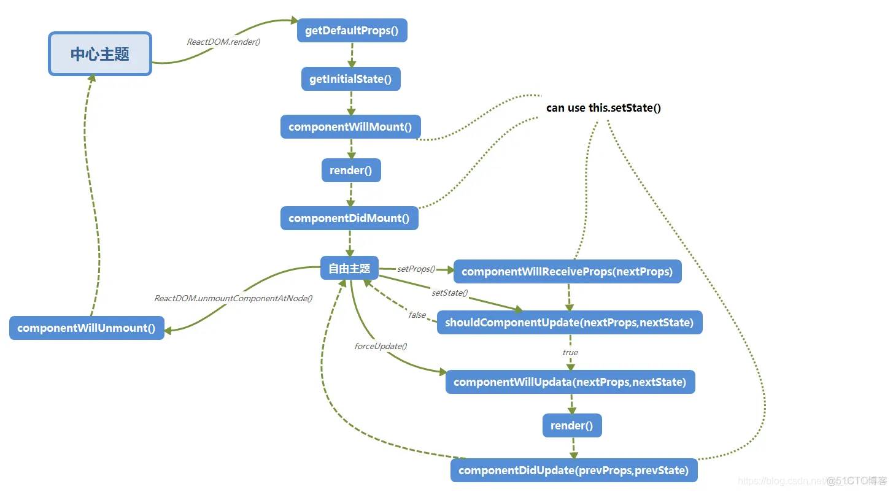
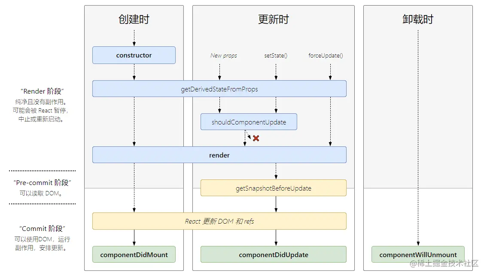

## react 15

> Mount 
>
> + Initalization
> + componentWillMount     (废弃)
> + render
> + componentDidMount

> Update
>
> + componentWillReceiveProps(nextProps)      (废弃)
> + shouldComponentUpdate(nextProps,nextState)
> + componentWillUpdate(nextProps,nextState)    (废弃)
> + render
> + componentDidUpdate(preProps,preState)

> 卸载
>
> + componentWillUnmount

> Mount 
>
> + Initalization
>
> + static getDerivedStateFromProps(nextProps,state) : 在调用 `render`方法之前调用，在初始化和后续更新都会被调用
>
>   返回值：返回一个对象来更新 `state`, 如果返回 `null` 则不更新任何内容
>
>   `eg. 静态函数只能做一些无副作用的操作，即，比较state props限制更新操作`
>
> + render
>
> + componentDidMount

> Update
>
> + getDerivedStateFromProps
>
> + shouldComponentUpdate(nextProps,nextState)
>
>   `涉及 React.PureComponent ,实现了此方法，对 props和state 进行浅层比较，减少比较耗费性能`
>
> + render
>
> + getSnapShotBeforeUpdate  
>
>   `getSnapshotBeforeUpdate()` 在最近一次的渲染输出被提交之前调用。也就是说，在 render 之后，即将对组件进行挂载时调用。
>
>   > 它可以使组件在 DOM 真正更新之前捕获一些信息（例如滚动位置），此生命周期返回的任何值都会作为参数传递给 `componentDidUpdate()`。如不需要传递任何值，那么请返回 null
>
> + componentDidUpdate(preProps,preState)

> 卸载
>
> + componentWillUnmount

## 从react fiber 架构 理解生命周期

+ render/reconcile
+ commit

###  reconcile阶段 

+ 根据jsx对象生成fiber对象，并打上etag,赋值为currentFiber
+ effectfiber链表存储有etag的节点，同时这些fiber节点中保存了变化的props

### commit

+ 1.beforeMutation 执行getsnaoShotBeforeUpdate ; 异步调度useEffect()

  `eg.useEffect异步执行的原因主要是防止同步执行时阻塞浏览器渲染。`

+ 2.Mutation 根据etag建立dom树，UPADATE:中间执行useLayoutEffect的销毁函数，DEL：`componentWillUnmount`，调度useEffect的销毁函数

+ 3.layout 此阶段也可访问真实dom节点，可赋值ref，

  生命周期：Mount 或 update （根据currentfiber）

  this.state 的回调函数

  同步调用useLayoutEffect回调函数

  调度useEffect的回调与销毁函数